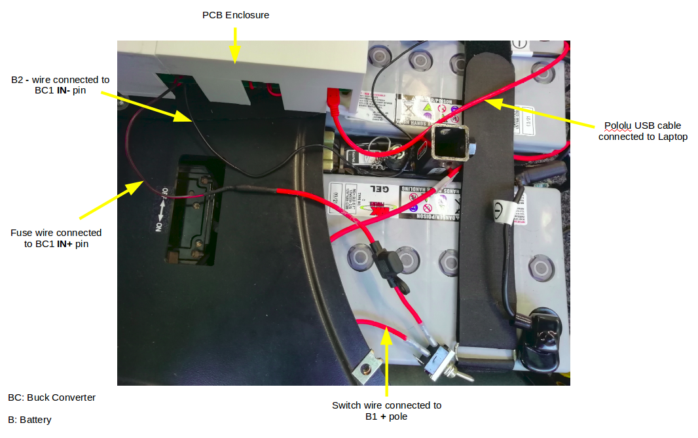
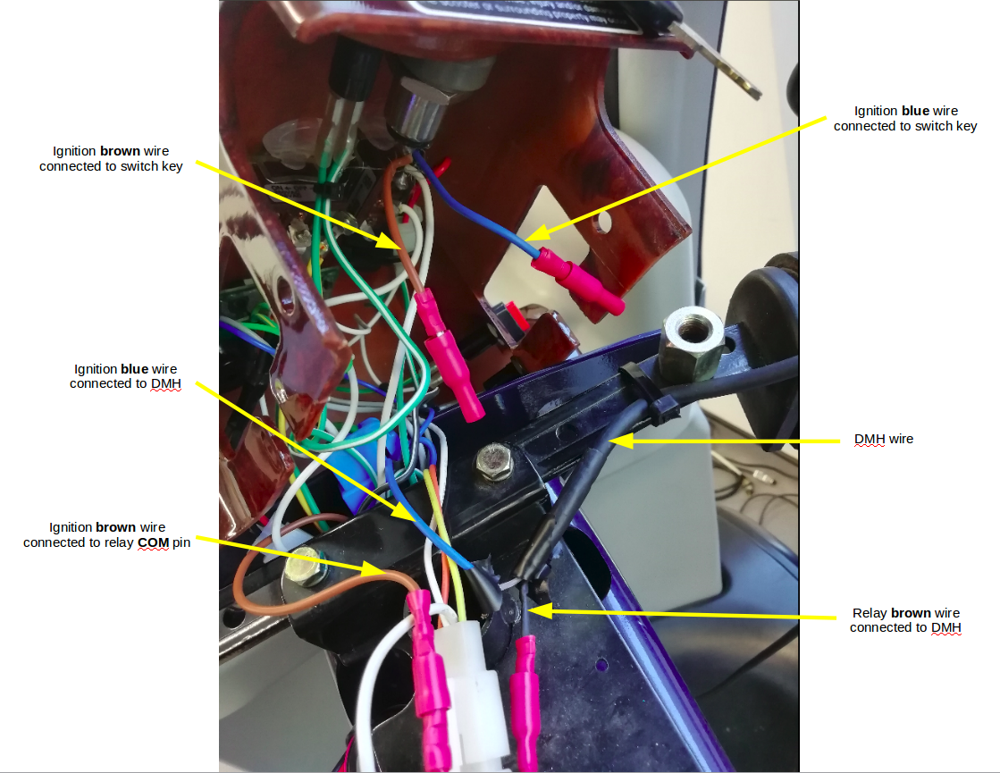

# OpenPodcar

Open Source Hardware Design and Software for OpenPodcar.


Video demo:  https://www.youtube.com/watch?v=ds1t9YaNA98

## Table of Contents
I. [General Info](#general-info)

II. [Bill of Materials](#bom)

III. [Software Setup](#software-setup)

IV. [Hardware Setup](#hardware-setup)

V. [User Guide](#user-guide)

VI. [General Testing](#general-testing)

VII. [3D Gazebo Simulation](#gazebo-simulation)

VIII. [Troubleshooting Guide](#troubleshooting-guide)

IX. [How to Contribute?](#how-to-contribute)

X. [Cite OpenPodcar](#cite-openpodcar)

XI. [Licence](#licence)

## I. <a name="general-info"></a> General Info

The OpenPodcar is an affordable and open source hardware and software platform for self-driving car research. It can be used for general autonomous vehicle research as well as for human-robot interaction (HRI) studies and practical automated transportation of people and goods.

The project includes:
- Hardware design and instruction to build and wire the physical car
- Arduino software for speed control
- Pololu software for steering control
- ROS drivers for whole vehicle steering and speed
- Gazebo simulation
- move_base and gmapping integration

To build the physical OpenPodcar, first obtain the components detailed in [Bill of Materials](#bom), then follow the steps of the build process detailed in [Software Setup](#software-setup), [Hardware Setup](#hardware-setup), [User Guide](#user-guide) and [General Testing](#general-testing). The 3D simulation can be directly installed in [3D Gazebo Simulation](#simulation).

## II. <a name="bom"></a> Bill of Materials
Obtain the following components, which are available from many commercial suppliers and some weblinks are suggested.

### 1. For the vehicle
- 1 Shoprider mobility scooter
- 1 3D Velodyne Lidar (VLP-16) with its controller box e.g. [Link to product](https://velodynelidar.com/products/puck/)
- 1 laptop under linux Ubuntu 16.04 e.g. [Link to product](https://www.lenovo.com/gb/en/laptops/thinkpad/p-series/ThinkPad-P51/p/22TP2WPWP51)
- 1 laptop under Windows 7+
- 1 Gimson Robotics GLA750-P 12V DC linear actuator with position feedback (250mm stroke) e.g. [Link to product](https://gimsonrobotics.co.uk/categories/linear-actuators/products/gla750-p-12v-dc-linear-actuator-with-position-feedback)
- 1 ON/OF Toggle/Flick switch button e.g. [Link to product](https://www.ebay.co.uk/itm/12V-HEAVY-DUTY-25A-UNIVERSAL-METAL-SPRING-MOMENTARY-ON-OFF-TOGGLE-FLICK-SWITCH/231257116468?epid=1229817686&hash=item35d7ff8f34:g:f50AAOSwq5lTmZKx)
- 1 USB hub (with at least 3 USB ports) e.g. [Link to product](https://www.amazon.co.uk/AmazonBasics-4-Port-Ultra-Mini-Bus-powered/dp/B003M0NURK/ref=sr_1_3?keywords=amazonbasics%2Busb%2Bhub&qid=1649172163&sr=8-3&th=1)
- 1 USB A cable (Arduino <-> Laptop)
- 1 USB mini B cable (Pololu <-> Laptop)
- 1 Ethernet cable (Velodyne <-> Laptop) 
- 1 deadman push button for the vehicle ignition system e.g. [Link to product](https://www.ebay.co.uk/itm/Philmore-30-825-SPST-Hand-Held-Push-Button-Switch-N-O/253746249505?epid=17011384611&hash=item3b14747f21:g:GdEAAOSwdA5bRopR)
- 1 Joystick with its USB cable e.g. [Link to product](https://www.logitechg.com/en-gb/products/space/extreme-3d-pro-joystick.942-000031.html)
- 1 Manfrotto Black Digi Table Tripod 709B e.g. [Link to product](https://www.manfrotto.com/ie-en/black-digi-table-tripod-709b/)
- 1 Inline car fuse e.g. [Link to product](https://www.ebay.co.uk/itm/BRAND-NEW-STANDARD-INLINE-CAR-FUSE-BLADE-HOLDER-30AMP-12V-SPLASH-PROOF-K265/170976134151?epid=23017011962&hash=item27cef8c407:g:NvoAAOSwtGNZzh9k)
- 1 fuse 7.5Amp
- 1 Relay e.g. [Link to product](https://www.ebay.co.uk/itm/164139969972?hash=item2637812db4:g:LqAAAOSwX9VefSO4)
- A few metric HEX bolts, nuts, flat washers and cap nuts
- A few cables ties

### 2. For the PCB
- 2 XL4016 Step-Down Buck converters DC-DC e.g. [Link to product](https://www.amazon.co.uk/dp/B086W6B9H1/ref=pe_27063361_485629781_TE_item?th=1)
- 1 Arduino Uno Rev3 e.g. [Link to product](http://store.arduino.cc/products/arduino-uno-rev3)
- 1 Pololu JRK 21v3 Motor Controller with Feedback e.g. [Link to product](https://coolcomponents.co.uk/products/jrk-21v3-usb-motor-controller-with-feedback-fully-assembled?variant=45223123918&gclid=CjwKCAjwo_HdBRBjEiwAiPPXpNz4xgpL7U6n4qPT4Y1LRuD8ukLQVzoA5_KsBCFyvRQVbbDKt1zKYRoCGTQQAvD_BwE)
- 1 MCP4725 DAC e.g. [Link to product](https://protosupplies.com/product/mcp4725-12-bit-dac-module/)
- 1 7-segment LCD with 3 digits e.g. [Link to product](https://www.alibaba.com/product-detail/Taidacent-Red-0-200V-Measurement-Range_60679181399.html?spm=a2700.details.0.0.1f1212advD463M)
- 1 Velodyne controller box (comes with the Velodyne lidar)
- 1 10K Resistor
- 1 100K Resistor
- 3 Screw Terminal Block connectors e.g. [Link to product](https://www.amazon.co.uk/Universal-Connector-Calculators-Electronic-Equipments/dp/B0922KLC4K/ref=sr_1_5?dchild=1&keywords=2+Pin+pinch+PCB+mount+screw+2.54&qid=1635870919&sr=8-5)
- Male and female headers for Arduino and Pololu JRK 21v3 e.g. [Link to product](https://www.amazon.co.uk/dp/B07CWSXY7P/ref=pe_27063361_485629781_TE_item)
- A few M1.5, M2.5 and M3 bolts 
- A few M1.5, M2.5 and M3 nuts 

### 3. Tools
- Soldering iron
- Solder
- Gauge Wires 
- Female and Male insulated electric connector crimp bullet terminals e.g. [Link to product](https://www.aliexpress.com/item/32874324815.html)
- Female and Male insulated crimp bullet terminals e.g. [Link to product](https://www.ebay.co.uk/itm/333917138391?_trkparms=amclksrc%3DITM%26aid%3D1110006%26algo%3DHOMESPLICE.SIM%26ao%3D1%26asc%3D20200818143230%26meid%3Deba078cf394f4611b763dffe1c093587%26pid%3D101224%26rk%3D2%26rkt%3D5%26sd%3D264495178129%26itm%3D333917138391%26pmt%3D1%26noa%3D0%26pg%3D2047675%26algv%3DDefaultOrganicWeb%26brand%3DUnbranded&_trksid=p2047675.c101224.m-1&amdata=cksum%3A333917138391eba078cf394f4611b763dffe1c093587%7Cenc%3AAQAGAAAB8C%252Fyb1lwqzYRQPn6yDPD%252FrO6eM54Ozija9VIM4RJxPwnf1iY01i8i01AGZBZPkn9u2ICy0UZ8GznjGHI5H3qlDdJfGplg3%252FnVmb7jjFFUM4IVEm7R3DPDtNxLKKHo%252BEwplCvVFY6kBB7EzGGuHW3LSvzdrBOknWZFElCIFXC9wNLCvDkuoMgSJcUhIQeym%252BWUipLsT6%252FksKzu7uTbHIhtonSUjivOjZmnmISIZ7%252FiQuJR4%252BbEOz%252BftDUwR%252BY48cJQBva8gKVlgfC29kTN%252B3cdMZZEg3%252FH7hEKiajloCOYUJ5Vne%252FNz%252BxQOMHJxAbFdWkJlP4Ek1uctcOCFbrasOOehfastcE8yTbS8sqH%252BrGGdBZ2W1JAq2Gm7fTQQp%252FKFJwXtc13AYOV2A538ViL5eTdtrrWKw7qH03MghtN%252BDdRT1IGU26MRDd29X4oGcDbrxLcdSzbxwjw2nLfDhD2KaJUQO%252B%252FfjmEn9ItE6IdiS7v%252FNc%252Bsg%252BJy2sVHs8Bj7rosDy%252FU358Txs9Ynb8yOlXX70O%252B1WTb4eEuaaNbwHXY2VR065xgoEGG84ZXV8RU5RZ74kZURWNMb4zdAxab5OpJDJxF1lJ3XCa9J7JaQN%252BaLV2qnIdGfTAjQDfcrRl9%252Fu4jZg0BP7Wz66zqauiz9cxYBh1Wc%253D%7Campid%3APL_CLK%7Cclp%3A2047675)
- Power supply 24V or more e.g. [Link to product](https://www.amazon.co.uk/Lavolta-Variable-Linear-Bench-Supply/dp/B019KL4G6I/ref=sr_1_8?dchild=1&keywords=bench+power+supply&qid=1629281239&sr=8-8)
- breadboard e.g. [Link to product](https://www.amazon.co.uk/K-H-RH-32-Solderless-Breadboard/dp/B07DNB74FV/ref=sr_1_26?keywords=breadboard&qid=1649177149&sprefix=breadbo%2Caps%2C100&sr=8-26)
- multimeter e.g. [Link to product](https://www.machinemart.co.uk/p/clarke-cdm10c-digital-multimeter-5-function/)
- clamp meter e.g. [Link to product](https://www.tester.co.uk/uni-t-ut210b-clamp-meter)
- Flathead and Phillips screwdrivers, pliers, automatic wire stripper [TODO etc -- what??]
- Spare fuses e.g. [Link to product](https://www.halfords.com/tools/fuses-electricals-and-fixings/fuses/)

## III. <a name="software-setup"></a> Software Setup

### 1. Ubuntu 16.04 and ROS

The OpenPodcar software stack requires a laptop working under Ubuntu 16.04 and with ROS Kinetic and Gazebo 7 installed:
- [Ubuntu 16.04 installation](https://ubuntu.com/tutorials/install-ubuntu-desktop#1-overview)
- [ROS Kinetic + Gazebo 7 installtion](http://wiki.ros.org/kinetic/Installation/Ubuntu)
- Clone this project repository somewhere on your laptop

**NB:** Pololu JRK 21v3 Configuration requires the installation of a Windows app, which does not work on linux.

### 2. Arduino
- Download the MCP4725 library file and place it into Arduino's **"LIBRARIES"** folder
- Arduino firmware source is supplied in the distribution ThrottleControlSerial.ino
- Connect the Arduino USB to the laptop
- Open Arduino IDE and the ThrottleControlSerial.ino file
- Click on **Upload**
- **Testing**
	- open Arduino serial monitor 
	- set baudrate to 115000
	- type in some commands such as:
		- **"FA:170"** for zeroing
		- **"FA:210"** for forward speed
		- **"FA:120"** for reverse speed
	- the serial monitor should display the command that was typed in and the corresponding DAC value
	
### 3. Pololu JRK 21v3 Configuration

- Download Pololu's Windows Configuration Tool by following these steps [here](https://www.pololu.com/docs/0J38/3.a).
- To configure the Pololu, please follow the instructions [here](https://www.pololu.com/docs/0J38/5).
- For OpenPodCar, we followed the steps below:
	- Connect the USB to Pololu and open "Pololu Jrk Configuration Utility" tool

	- Go to "**Input**" tab: 
		- set "**Input mode**" to "**serial**"
		- keep all other parameters to default values
		- Final settings should like here:
		
	<p align="center">
	
	</p>

	- Go to "**Feedback**" tab:
		- set "**Feedback mode**" to "**Analog voltage**"
		- check "**Invert feedback direction**"
		- Calibration:
			- set "**Absolute Max**" to "**2600**"
			- set "**Maximum**" to "**2600**"
			- set "**Minimum**" to "**1000**"
			- set "**Absolute Min**" to "**1000**"
			- keep all other paramters to default values
		- Final settings should like here:
	
	<p align="center">
	
	</p>

	- Go to "**PID**" tab:
		- set "**Proportional Coefficient**" to "**6**" at the top and "**1**" at the bottom, so that to get a final "**3**"
		- keep all other parameters to default values 
		- Final settings should like here:

	<p align="center">
	
	</p>

	- Go to "**Motor**" tab:
		- check "**Invert motor direct**"
		- in the "**Forward column**", set "**Max. current (A)**" to "**0**"
		- keep all other parameters to default values
		- Final settings should like here:
		
	<p align="center">
	
	</p>

	- Go to "**Error**" tab:
		- you should see a window (cf. photo below) similar to this with some red flags on	
		- set "**No power**", "**Motor driver error**", "**Feedback disconnected**" and "**Max. current exceeded**" to "**Enabled and latched**"
		- click on "**Clear**" and "**Reset**"
		
	<p align="center">
	
	</p>

	- Click on "**Apply settings to**"
	
	
### 4. Simlink for USB COM Ports

Here, the goal is to create persistent USB serial device names (aka SIMLINK) for the Arduino and the Pololu.

- In terminal: `sudo nano /etc/udev/rules.d/99-tty.rules`
- Connect the Arduino and the pololu via USB to your laptop, then type in the terminal:
```
sudo lsusb -v | grep 'idVendor\|idProduct\|iSerial'
```
- The above command displays the idVendor and idProduct for all the serial devices connected to your laptop and needs to be reported in the Simlink. 
- For example, for the OpenPodcar copy the following lines in "99-tty.rules":
```
#Arduino com-port rules
SUBSYSTEM=="tty", ATTRS{idVendor}=="2341", ATTRS{idProduct}=="0043", SYMLINK+="ttyArduino", GROUP="dialout", MODE="0666"
#Pololu com-port rules -- NB the pololu has two virtual serial ports on a single USB interface.
SUBSYSTEM=="tty", ATTRS{idVendor} =="1ffb", ENV{ID_USB_INTERFACE_NUM}=="00"  SYMLINK+="ttyPololuCOM"
SUBSYSTEM=="tty", ATTRS{idVendor} =="1ffb", ENV{ID_USB_INTERFACE_NUM}=="02"  SYMLINK+="ttyPololuTTL"
```
- Save and close "99-tty.rules" file
- Then type in the terminal `sudo reboot`
- Check the status of each SIMLINK by typing in terminal for example: `ls -l /dev/ttyArduino` or `ls -l /dev/ttyPololuCOM`

	
### 5. Velodyne 3D Lidar Configuration for ROS

The lidar needs to be set up over Ethernet. The laptop must be on a wired network, not wifi. The IPs must be configured as in the velodyne. The default lidar IP is 192.168.1.201.

Please follow the Velodyne installation instructions for ROS from [here](http://wiki.ros.org/velodyne/Tutorials/Getting%20Started%20with%20the%20Velodyne%20VLP16).


## IV. <a name="hardware-setup"></a> Hardware Setup

### A. Doors and Seat Removal

- Remove the screws from the hinges in order to remove the doors.
- Remove the seat by following the instructions given in the vehicle service manual.

### B. Linear Actuator

Before mounting the linear actuator under the vehicle, first acceptance test it with the Pololu to check that it is functional.

#### 1. Acceptance Testing

This section shows how to test the linear actuactor before mounting it.

- Material: Gimson linear actuator, Pololu JRK 21v3 Configuration Tool, external power capable of supplying 12V, a breadboard, some wires, a multimeter
- Start testing the linear actuator as follows:
- Wire the power supply **-** to Pololu's **GND**
- Wire the power supply **+**  to Pololu's **VIN** 
- Wire the linear actuator's **black wire** to Pololu's **A**
- Wire the linear actuator's **red wire** to Pololu's **B**
- Use a breadboard to make the following connections:
	- Wire the linear actuator's **blue wire** to Pololu's **FB** 
	- Wire the linear actuator's **yellow wire** to Pololu's **+5V** (pin below **FB**)
	- Wire the linear actuator's **white wire** to Pololu's **GND** (pin below **+5V**)
	- Set the external power to supply 12V -> the Pololu LED should start blinking orange
	- Connect the Pololu USB to a computer with the "**Pololu Jrk Configuration Utility**" Tool
- Open the Configuration Tool Interface and go to the **Error** tab to check that no error is displayed other than the flag waiting for new commands. 
	- If there are errors, click on "**Reset**" and "**Clear**" until the Poolu's LED start blinking green
	- Go to **Input** tab and use the cursor to send commands to the linear actuator e.g.
	- "2500" : the linear actuator should extend its length to a maximum
	- "1500" : the linear actuor should reduce its length
	- "1900" : the linear actuator should have a medium length. NB: this is the position that the linear actuator should have when mounting it underneath the vehicle
		
#### 2. Access the underside of the vehicle

To access the underside of the vehicle, this requires the help of at least three people.

- Material: 2 axle stands, 2 jacks
- Bring in two axle stands and set them as high as 75cm each
- Place the two axle stands about one meter away from the front and back wheels, both in the same side of the vehicle, as shown in red in the picture below.
	
	<p align="center">
	
	</p>
	
- Place two jacks right next to the front and back wheels, on the same side as the axle stands as shown in green in the above picture
- One person should stand next to each axle stand
- Another person should stand on the other side of the vehicle and push the vehicle from the top towards the people next to the axle stands
- The persons next to the axle stands should adjust the positions of the stands in order to get the vehicle nicely tilted without any instability
- The vehicle should now be tilted on one side and its underside clearly visible in order to mount the linear actuactor
 
#### 3. Mounting

```diff
- MOUNTING THE LINEAR REQUIRES DRILLING THROUGH STEEL USING A SUITABLE POWERFUL DRILL AND QUALIFIED OPERATOR. 
- THERE IS POTENTIAL FOR INJURY TO UNQUALIFIED OPERATORS. THIS IS THE ONLY BUILD STEP WHICH REQUIRES A QUALIFIED OPERATOR.
```

- Material: Gimson linear actuator, a drill capable of drilling steel, 2 [M5?] HEX head bolts, 2 HEX nuts, 2 cap hex nuts and a few flat washers with 8mm diameter
- The linear actuator must have a medium length obtained via the Pololu command "1900", cf. the **Acceptance Testing** detailed above. 
- There is an existing hole in the triangular part of chassis next to the right front wheel axle, shown in the figure below in the green circle. Fix the front hole of the linear actuator to this use using an M5 [# check] bolt, nut, several washers and a cap nut
- Drill a new M5 [# check] hole on the left side of the front chassis at the location shown by the red circle in the photo below.
- Fix the back of the linear actuactor to the newly drilled hole using an M5 [# check] bolt, via washers
- The final mounting is shown in the photo below.
	
	<p align="center">
	
	</p>

- Once the mounting is finished, bring the podcar back to its normal position (requires again at least 3 people). 
- Remove the axle stands and jacks before making the integration test of the linear actuactor.

#### 4. Integration Test

This final test will helps to verify that the linear actuactor is well mounted and can steer the wheels as expected

- Place two jacks on each side under the vehicle
- Repeat the **Acceptance Testing** protocol presented above, but this time with the linear actuactor mounted under the vehicle, its wires can pass through an empty area between the vehicle plastic bumper and the left battery, and send some commands such as:
- a "2500" command should steer the front wheel to the far right, i.e about -45 deg
- a "1900" command should keep the front wheels facing forward, i.e. about 0 deg
- a "1500" command should steer the front wheels to the far left, i.e. about +45 deg
		
### C. ON/OFF Switch and Fusing

- Material: inline car fuse, fuse 7.5Amp, ON/OFF switch, x2 12V batteries (the ones in the vehicle, under the seatback), some wires [TODO what thickness?]
- Fix a tick wire using a crimp bullet terminal onto each pin of the switch
- Get access to the right battery's **+** pole and use a plier to unscrew the bolt and flat washer.

	<p align="center">
	
	</p>

- Strip the wire on the **+** pin of the switch by 3cm and connect it to the **+** of the right battery by tangling it around the battery **+** pole
- Screw back the bolt and flat washer that were removed from the battery **+** pole
- Connect the fuse **-** wire to the switch **-** pin
- Extend the fuse **+** wire by 30cm such as soldering another tick wire to it, then keep it safely for later connection with the buck converter **+** on the PCB board
- Get access to the left battery's **-** pole's wire, strip a small area in the middle and plug a new and long wire (~50cm) there, then keep this new wire safely for later connection with the buck converter **-** on the PCB board as shown below.

	<p align="center">
	
	</p>


### D. 3D Lidar

- Material: 3D lidar, tripod, a drill, 3 cable ties 
- Place the tripod on the vehicle's roof as shown in the photo below and use a marker to mark the positions of its three feet.	

	<p align="center">
	
	</p>

- Remove the tripod from the roof.
- Drill two holes, 0.6mm diameter each and their centers separated by about 1cm, on either side of each marked position as shown in the photo below.

	<p align="center">
	
	</p>

- Screw the lidar onto the tripod. (Note that lidars are optical equipment which use Imperial rather than metric bolt threads, even in the EU.)
- Place the tripod back on the roof.
- Use three cable ties, each passed through one pair of drilled holes and around a tripod foot, to secure the tripod to the roof as shown in the photo below. (may require the intervention of two people)

	<p align="center">
	
	</p>

### E. Buck Converters

Here, the buck converters voltage and current will be set to the desired values and then tested.

- Material: buck converters, power supply, multimeter, electronics flathead screwdriver, clamp meter and some wires [TODO what thickness?]

#### 1. XL4016 Buck converter 1

1. Connect the wire from the power supply **+** to the buck converter's **IN+** terminal block using a tick wire and screwdriver
2. Connect the wire from the power supply **-** to the buck converter's **IN-** terminal block using a tick wire and screwdriver
3. [TODO update] Insert a (tick) wire into the buck converter's **OUT+** terminal block and keep the other side of the wire safely aside
4. Insert a (tick) wire into the buck converter's **OUT-** terminal block and keep the other side of the wire safely aside
5. Set the power supply to 24V and turn it on
6. Use the multimeter to measure the **voltage** between the buck converter's **OUT+** and **OUT-**
7. Whilst reading the multimeter, use a screw driver to turn the **potentiometer P1** on the buck converter until the desired output voltage of 16V is reached (or the voltage required for the linux laptop)
8. **Voltage Testing:** 
	- Turn off the power supply and stop using th screw driver
	- Turn on the power supply back to 24V
	- Use the multimeter to check that the **voltage** between the buck converter's **OUT+** and **OUT-** is indeed 16V
	- If not, then repeat steps 5 to 8
9. Use the multimeter to measure the **current** between the buck converter's **OUT+** and **OUT-**
10. Whilst reading the multimeter, use a screw driver to turn the **potentiometer P2** on the buck converter until the desired output current of 3.75A is reached (or the maximum current required for the linux laptop)
11. **Current Testing**
	- Turn off the power supply and stop using th screw driver
	- Turn on the power supply back to 24V
	- Use the clamp meter to check that the **current** in the buck converter's **OUT+** wire is indeed 3.75A
	- If not, then repeat steps 9 to 11
		
#### 2. XL4016 Buck converter 2

1. Wire the power supply **+** to the buck converter's **IN+** terminal block using a tick wire and screwdriver
2. Wire the power supply **-** to the buck converter's **IN-** terminal block using a tick wire and screwdriver
3. Insert a (tick) wire into the buck converter's **OUT+** terminal block and keep the other side of the wire safely aside
4. Insert a (tick) wire into the buck converter's **OUT-** terminal block and keep the other side of the wire safely aside
5. Set the power supply to 24V and turn it on
6. Use the multimeter to measure the **voltage** between the buck converter's **OUT+** and **OUT-**
7. Whilst reading the multimeter, use a screw driver to turn the **potentiometer P1** on the buck converter until the desired output voltage of 12V is reached (or the voltage required for the Pololu and 3D Lidar)
8. **Voltage Testing** 
	- Turn off the power supply and stop using th screw driver
	- Turn on the power supply back to 24V
	- Use the multimeter to check that the **voltage** between the buck converter's **OUT+** and **OUT-** is indeed 12V
	- If not, then repeat steps 5 to 8
9. Use the multimeter to measure the **current** between the buck converter's **OUT+** and **OUT-**
10. Whilst reading the multimeter, use a screw driver to turn the **potentiometer P2** on the buck converter and set the desired output current of 3A is reached (or the maximum current required for the linear actuator and 3D Lidar)
11. **Current Testing**
	- Turn off the power supply and stop using th screw driver
	- Turn on the power supply back to 24V
	- Use the clamp meter to check that the **current** in the buck converter's **OUT+** is indeed 3A
	- If not, then repeat steps 9 to 11
			
### F. MCP4725 DAC

- Solder the male headers provided for the DAC pins.
- **Acceptance Testing**
	- Material: MCP4725 DAC, Arduino, some wires, multimeter
	- Use a breadboard to make the following connections:
		- Wire both DAC **GND** to both Arduino **GND**, using two female to male wires
		- Wire the DAC **VCC** to Arduino **5V**, using a female to female wire
		- Wire the DAC **SDA** to Arduino **SDA**, using a female to male wire
		- Wire the DAC **SCL** to Arduino **SCL**, using a female to male wire
		- Wire the DAC **OUT** to an isolated point on the breadboard, using a female to female wire
	- Turn on the Arduino by connecting it via USB to a computer 
	- Use the multimeter to measure the voltage received on the DAC:
		- Voltage between the DAC **GND** and **VCC** should give a value between **4.7V** to **5V** i.e. equivalent to Arduino input voltage
		- Voltage between the DAC **GND** and **OUT** should give a value between **1.9V** and **2.4V**
			
### G. 3D Printing
The following items need to be 3D printed, the files are located under `physicalVehicleNonRos/3D_parts`:
- LCD display support part **LCD_support.stl**
- Velodyne Lidar support part **VLP16_support.stl** 

### H. Printed Circuit Board (PCB)

Manufacture the PCB board by sending the gerber zip files `physicalVehicleNonRos/PCB/gerber.zip` to an online PCB manufacturer such as (https://www.pcbway.com). They will then post the bare board to you, usually in a few days. At this stage there are no components on it, you will solder them on later in these instructions. NB: You may wish to order several copies of the PCB in case of manufacturing errors or if you break one or more of them.
	
#### 1. Acceptance Testing

- Material: PCB board, multimeter
- Use the multimeter in continuity mode (diode symbol) to check each one of the PCB connections. If a connection on the board is continuous i.e. good, then the multimeter emits a continuous **beep**  (takes around 5 minutes in total). If any connection is not good then the manufactured PCB board is faulty and should not be used.

#### 2. Assembly

- Material: soldering iron, headers, Arduino, Pololu, resistors
- Solder headers for Arduino
- Solder a 10K resistor on R2 location
- Solder a 100K resistor on R1 location
- Solder female headers for the Pololu
- Solder the buck converter wires to the respective pins on the board
- Use M3 bolts and nuts to fix the buck converters, Arduino, LCD display, lidar support onto the board
- USe M1.5 bolts and nuts to fix the DAC onto the board
- Use M2 bolts and nuts to fix the Pololu onto the board


#### 3. Integration Testing

The PCB board was heavily tested before and after assembling its components to ensure that once it is integrated into the vehicle, there would not be any big issue. 
- Material: external power supply, multimeter
- Material: power supply, multimeter, some wires
- Measure the voltage across the PCB components, check the safety of the board and ensure that the components work as expected.

	<p align="center">
	
	</p>
	
		
### I. Vehicle Connections

#### A. DeadMan Handle (DMH) and Relay

This step explains how to integrate a DMH and a relay in order to control the vehicle ignition system. The addition of the Relay and the DMH Switch are essential for safe operation, especially where new unproven autonomous control systems are in development. A two stage approach is used to reduce this risk. Refer to the schematic diagram DMH section in conjunction with this description.

- Material: 1 deadman push button, 1 relay, wires, female and Male insulated electric connector crimp bullet terminals, a plier
- For the relay: 
	- Connect a 2-meter wire to the relay's **-** pin 
	- Connect a 2-meter wire to  both the relay pins **S** and **+**
	- The relay wires should be as shown in the photo below

		<p align="center">
		
		</p>
		
	- Use electrical insulating tape to wrap the relay with as shown below.
	
		<p align="center">
		
		</p>
	
	- Use a plier to cut the two wires **brown** and **blue** connected to the vehicle ignition key	
	- Attach a female insulated electric connector crimp bullet terminal to the **blue** wire directly connected to the ignition key
	- Attach a female insulated electric connector crimp bullet terminal to the **brown** wire directly connected to the ignition key
	- Connect the relay's **COM** pin to the ignition **brown** wire coming from the vehicle steering column using a female insulated electric connector crimp bullet terminal
	- Connect the relay's **NO** pin to the ignition **blue** wire coming from the vehicle steering column using a female insulated electric connector crimp bullet terminal

- For the DMH: 
	- Connect a 3-meter wire to the deadman push button
	- Connect the deadman wire to the wire linking the relay **NO** pin and the ignition **blue** wire as shown in the photo and the circuit diagram below:
	
	<p align="center">
	
	</p>	


	<p align="center">
	
	</p>	

#### B. Speed Potentiometer 

- Material: wires, soldering iron, 1 plastic screw terminal block 2x2
- De-solder the middle pin of the vehicle potentiometer (white wire) and connect it to a 2-meter long wire inserted into the terminal block **+** pin
- Solder a 2-meter long wire next to the potentiometer pin on the left with a yellow wire and insert in its other length into the terminal block **-** pin

#### C. PCB connections

- Solder the other side of the relay's **+** and **S** pins wire to the LCD **VIN** pin on the PCB board
- Solder the other side of the realy's **GND** to the LCD **GND** pin on the PCB board
- Insert the lidar controller box **+** wire to the PCB terminal block **+** pin (NB: another option would be to solder instead of inserting) 
- Insert the lidar controller box **-** wire to the PCB terminal block **-** pin (NB: another option would be to solder instead of inserting) 
- Connect the DAC **VOUT** to the terminal block **+** pin linked to the vehicle speed potentiometer 
- Connect the DAC **GND** to the terminal block **-** pin linked to the vehicle speed potentiometer
- Connect the LCD **SIG** wire to the terminal block **+** pin linked to the vehicle speed potentiometer 
- Connect the fuse **+** wire to buck converter 1's **IN+** pin
- Connect the fuse **-** wire to buck converter 1's **IN-** pin


#### D. Connect the linear actuactor to the Pololu JRK 21v3
- Wire the linear actuator's **black wire** to Pololu's **A**
- Wire the linear actuator's **red wire** to Pololu's **B**
- Use a breadboard to make the following connections:
	- Wire the linear actuator's **blue wire** to Pololu's **FB** 
	- Wire the linear actuator's **yellow wire** to Pololu's **+5V** (pin below **FB**)
	- Wire the linear actuator's **white wire** to Pololu's **GND** (pin below **+5V**)
		

## V. <a name="general-testing"></a> General Testing

### A. Speed control

Implementing and testing this safety system should be undertaken with the drive wheels of the vehicle raised off of the ground, allowing for checks to be made of the DMH without the risk of the vehicle speeding off out of control.

- Material: jacks
- Place the jacks on both of the vehicle to raise its wheels off of the ground
- open a terminal and `cd physicalVehicleNonRos/testingTools/`
- while pressing on the DMH:
	- type `python zeroSpeed.py` to zero the speed
	- type `python fastSpeed.py` to move the vehicle forward (speed commands can be modified)
	- type `python slowSpeed.py` to move the vehicle backward (speed commands can be modified)


### B. Steering Control

The steering can be tested with Linux command. 
- Connect the Pololu USB to the laptop 
- Open a terminal and make sure "**physicalVehicleNonRos/testingTools/JrkCmd**" is allowed as an executable
- type `./OpenPodcar/podcar/physicalVehicleNonRos/testingTools/JrkCmd Val` where "Val" is the desired command e.g. 1900 (straight), 2100 (turning slightly on the right), 1700 (turning slightly on the left) etc. 
"Val" should be a value between 1000 (fully turned left) and 2500 (fully turned right).


### C. Object Detection and Tracking

To run the object detector and tracker:
- record a ROS bag file with some pedestrians in it
- change the path of the bag file in **flobot_tracker.launch** to that of your bcd ag file
- open a terminal and type:
```
cd OpenPodcar/catkin_ws/src/FLOBOT
source devel/setup.bash
roslaunch flobot_tracker_bringup flobot_tracker.launch
```


## VI. <a name="user-guide"></a> User Guide 

- Check that the vehicle’s original lever for auto-manual is set to auto (DOWN). It is on the main motor, under the vehicle at the rear left, colored red. Requires some force to move it.

- Power on the vehicle using the original on-off switch located under the seat on the left. It is marked ON-OFF.

- Power on the modified electronics using the new toggle switch.   (This lights LEDs on the DCDCs and Pololu, and the lidar makes a whirring sound).

- Check that the batteries are charged (use a multimeter across one of the DCDC converters, need to see 24V or over. {\em Do not use the vehicle if it is undercharged, this is dangerous.}

- Power on the laptop using the slider switch on its front right.

- Type:  roscd podcar


### A. Remote Control
 
Once the speed and steering control are tested and work well, the vehicle can be remotely-controlled using a joystick:
- Check that the lidar Ethernet, Joystcik USB, Pololu USB and Arduino USb cables are all connected to the laptop
- Change this line ` <include file="/home/fanta/phd_work/OpenPodcar/podcar/catkin_ws/src/velodyne/velodyne_pointcloud/launch/VLP16_points.launch"/>` to the path of Velodyne point_cloud in `/launch/podcar.launch` to the path corresponding to that of your laptop
- Open a terminal and type:
```
cd OpenPodcar/catkin_ws/src/podcar
source devel/setup.bash
roslaunch podcar podcar.launch
```

If the USB ports are well set up, the vehicle can then be simply controlled with the joystick as follows:
- Y-axis for speed control
- X-axis for steering control
 
 
### B. Move_base Control

This section explains how to drive the OpenPodcar in autonomous control mode using GMapping, move_base and the TEB planner.
- Check that the lidar Ethernet, Pololu USB and Arduino USb cables are all connected to the laptop
- Change the path of Velodyne point_cloud in *velodyne.launch** to the path corresponding to that of your laptop
- open a first terminal and type:
```
cd OpenPodcar/catkin_ws/src/podcar
source devel/setup.bash
roslaunch podcar podcarsim2real_laser_scan_matcher.launch
```
- open a second terminal and type:
```
cd OpenPodcar/catkin_ws/src/podcar
source devel/setup.bash
roslaunch podcar podcarsim_moveBase_sim2real.launch
```

At this stage, two options are available to send goal commands to the vehicle:
- Option 1: RViz GUI
	- Use RViz graphical user interface to set a goal command for the vehicle using the green arrow

- Option 2: Terminal 
	- open a third terminal and type:
	```
	cd OpenPodcar/catkin_ws/src/podcar
	source devel/setup.bash
	rostopic pub /move_base_simple/goal geometry_msgs/PoseStamped "frame_id: 'map' pose: position: x: 2.0 y: 0.0 z: 0.0 orientation: x: 0.0 y: 0.0 z: 0.0 w: 1.0"
	```
	The example command above will move the vehicle 2m forward in **map** frame whilst keeping the same default orientation.

The figure below shows the complete ROS node configuration used during this autonomous driving mode.
	<p align="center">
	
	</p>

Note:
- the vehicle orientation is formed by the quaternion: x, y, z and w. Euler angles can be converted to quaternions using this [visualisation tool](https://quaternions.online/)
- Recommended to open terminal(s) to check topics values and data received within ros using `rostopic echo topicName`, for example:
	- `rostopic echo /velodyne_points` displays the lidar data (a huge flow of numbers should appear in the terminal)
	- `rostopic echo /odometry/groundTruth` displays the vehicle position and orientation
- Other useful commands include for example: `rosrun rqt_graph rqt_graph`, `rosrun tf tf_monitor`, `rosrun tf view_frames`. 


## VII. <a name="gazebo-simulation"></a> 3D Gazebo Simulation

### A. Installation

- Assuming: ROS Kinetic and Gazebo 7 already installed. Install instructions can be found [here](http://wiki.ros.org/kinetic/Installation/Ubuntu).

- Rosdep is also required, but is standalone since ROS Fuerte. Install instructions can be found [here](http://wiki.ros.org/rosdep).

- To install the ros package and gazebo sim locally, clone the repository and run the follow commands (directories indicated by <> need to be replaced by their actual locations):

```bash
cd <install location>/catkin_ws
catkin_make
source devel/setup.bash
cd src/podcar/models/plugins
cmake .
make
export GAZEBO_PLUGIN_PATH=$GAZEBO_PLUGIN_PATH`pwd`:
cd ..
export GAZEBO_MODEL_PATH=$GAZEBO_MODEL_PATH`pwd`:
cd ../../../
rosdep install --from-paths src --ignore-src -r -y
roslaunch podcar podcarsim.launch
```

The first run of Gazebo may take a while (e.g. 5 minutes) to load because models used need to be automatically downloaded from the remote gazebo repositories.

- Once the simulation is running, you can then launch one of two different systems to control the robot: manual joystick control or movebase control.


### B. Joystick control

If you have a USB joystick connected, open a new terminal and run,

```bash
source <install location>/catkin_ws/devel/setup.bash
roslaunch podcar joystick.launch
```

The figure below shows the complete ROS node configuration used during simulation, under manual joystick control.
	<p align="center">
	
	</p>


### C. Move_base control

Open a new terminal and run,

```bash
source <install location>/catkin_ws/devel/setup.bash
roslaunch podcar podcarsim_moveBase.launch
```

This will present a standard movebase GUI interface in rviz, enabling you to click desired destinations to command the vehicle to drive to.

## VIII. <a name="troubleshooting-guide"></a> Troubleshooting Guide

### A. Vehicle
- Vehicle beeps continuous when press DMH and rear wheels do not move
	- This is due to a safety mode preventing ignition.

	- Check: is the manual-auto switch under the rear motor on auto?

	- Check: are the batteries well charged (must be 24V or over.) ?

	- Check: is the control voltage is the dead zone ? It should be.

- Rear wheels do not move, control voltages are correct
	- Control voltages means the display on the voltmeter LED. Should be above 1.2 or below 1.8 for forward and backwards.

	- Check: main vehicle battery level, by connecting the vehicle charger and inspecting the battery charge level. Problem occurs if the battery is nearly flat.

	- Check: charger must be disconnected for rear wheels to move (safety feature).
	
- Linear Actuator
	- Diagnostic test commands can be passed to the Polulo using the commands provided in /testingTools/cmdSteer.   {\em Do not give commands outside the range 1000-2500 as they have mechanically destroyed the the vehicle.} A non-ROS test of the C API for the Pololu is provided in /testingTools/pololuTestCSerial.
	
- Speed
	- It receives commands of the form “FA:210” as speed commands. The test scripts /testingTools/zeroSpeed.py and /testingTools/testSpeed.py can be used to send example commands for debugging.
	
- Simlink
	- If the Simlink does not work, display all the devices by typing in terminal `ls -l /dev` to see whether your device is connected well.
	- The idVendor and idProduct can also be displayed in the commandline for each connected USB device, such as `udevadm info -q all -a -n /dev/ACM0` for the device connected at COM Port ACM0

### B. Lidar
- No velodyne_points message published
	- Check: laptop must be on wired network, not wifi.

	- Check: wired network must be configured correctly, see velodyne setup docs. Maybe be interfered if wifi has been used recently.
	
	- Check connections to Velodyne box including power and ethernet.
   

### C. Simulation
- AF\_NET error
	- If this is thrown by the Gazebo plugin -- it may be because Gazebo is being run standalone rather than launched as a ROS node as required.
	
- Cannot locate node i.e. you should make your Python scripts as executables in order to launch them

## IX. <a name="how-to-contribute"></a> How to Contribute? 

Contributions to and forks of OpenPodcar are strongly encouraged and welcomed.

Useful contributions to improve the current design could include:

- Replace the donor vehicle’s propriatory motor driver with the OSMC open source hardware motor driver

- Port the ROS code to ROS2

- Update ROS code to enable swarms of multiple podcars operating together

- Add a 3d stereo camera to the hardware and software

- Replace the body and wheels of the donor vehicle with an OSH alternative, keeping the sensors, mechatronics, and software the same.

- Interface the system into Autoware

Possible forks could include:

- Port the mechatronics and software to run on other closed source mobility scooters

- Port the mechatronics and software to run on other classes of vehicles

We would be very interested to hear about and discuss your plans, so please get in touch if interested to contribute or fork. 

Email contacts: Fanta Camara (tsfc@leeds.ac.uk / fcamara@lincoln.ac.uk) and/or Charles Fox (chfox@lincoln.ac.uk)


## X. <a name="cite-openpodcar"></a> Cite OpenPodcar

Please cite the following paper when you use the OpenPodcar.

Plain:
```
Fanta Camara, Chris Waltham, Grey Churchill, Charles Fox. 
OpenPodcar: an Open Source Vehicle for Self-Driving Car Research. 
Journal of Open Hardware (under review).
```
Bibtex:
```
@Article{camara2022openpodcar,
  Title                    = {OpenPodcar: an Open Source Vehicle for Self-Driving Car Research},
  Author                   = {Fanta Camara and Chris Waltham and Grey Churchill and Charles Fox},
  Year                     = {2022},
  Journal                  = {Journal of Open Hardware (under review)},
```

## XI. <a name="licence"></a> Licence 

This work is provided under CERN-OHL-W licence. 

Disclaimer: Neither the authors nor the University of Lincoln are repsonsible for accidents, injuries or damage caused by this vehicle design, and by downloading, building or operating the design you agree to do so entirely at your own risk. The design is not a legal product and carries no safety certification.
